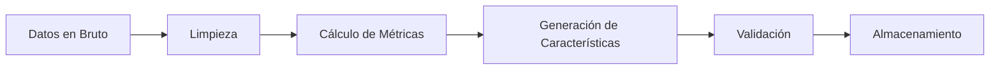
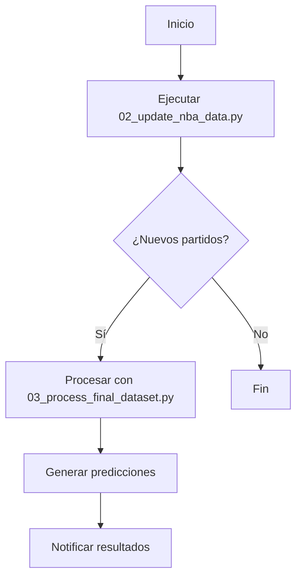

# 🏀 Sistema de Predicción de la NBA

## 📋 Resumen del Proceso

1. **📥 01 - Recolección de Datos**
   - `01_fetch_nba_data.py`: Carga inicial completa
   - `02_update_nba_data.py`: Actualización diaria

2. **🔄 03 - Procesamiento de Datos**
   - `03_process_final_dataset.py`: Transformación y limpieza
   - Generación de características avanzadas

3. **🤖 04/05 - Modelado**
   - `04_train.py`: Entrenamiento básico
   - `05_train_model_advanced.py`: Entrenamiento avanzado

4. **🔮 Predicciones**
   - `predict_season.py`: Generación diaria de predicciones
   - `06_predict_upcoming_games.py`: Predicciones en tiempo real para los partidos del día actual

5. **📊 Monitoreo** (Continuo)
   - Validación de datos
   - Seguimiento de rendimiento

# 🔍 Detalles Técnicos

## 1. Recolección de Datos

### 📊 Fuentes
- **API Oficial de la NBA**
  - Estadísticas en tiempo real
  - Datos detallados por partido
  - Información de jugadores lesionados

- **Basketball-Reference**
  - Estadísticas históricas
  - Métricas avanzadas
  - Eficiencia ofensiva/defensiva

### ⚙️ Scripts
1. **Carga Inicial** (`01_fetch_nba_data.py`)
   - Descarga completa de datos históricos
   - Uso único o para reinicialización

2. **Actualización Diaria** (`02_update_nba_data.py`)
   - Sincronización incremental
   - Solo descarga partidos nuevos
   - Validación de integridad

## 2. Procesamiento de Datos

### 🔄 Flujo de Procesamiento


### 📊 Características Generadas
- **Básicas**
  - Puntos por partido
  - Porcentajes de tiro
  - Rebotes y asistencias

- **Avanzadas**
  - Eficiencia ofensiva/defensiva
  - Net Rating
  - Promedios móviles (5, 10, 20 partidos)

- **Contextuales**
  - Días de descanso
  - Back-to-back
  - Distancias de viaje

## 3. Modelado

### 🤖 Modelos Disponibles
1. **Random Forest**
   - Rápido entrenamiento
   - Buen rendimiento general
   - Fácil interpretación

2. **XGBoost**
   - Mayor precisión
   - Manejo de relaciones no lineales
   - Requiere más ajuste

### 📈 Métricas Clave
- **MAE**: Error absoluto medio
- **RMSE**: Raíz del error cuadrático medio
- **R²**: Varianza explicada

### 📊 Resultados Típicos
| Métrica | PTS_HOME | PTS_AWAY |
|---------|----------|----------|
| MAE     | ~9.0     | ~9.2     |
| RMSE    | ~11.3    | ~11.5    |
| R²      | ~0.20    | ~0.19    |

## 4. Implementación

### 🚀 Despliegue
1. **Requisitos**
   - Python 3.8+
   - Dependencias en `requirements.txt`
   - 2GB de espacio en disco

2. **Instalación**
   ```bash
   # Clonar repositorio
   git clone [url-del-repositorio]
   cd nba_advanced_stats
   
   # Instalar dependencias
   pip install -r requirements.txt
   
   # Configurar variables de entorno
   cp .env.example .env
   ```

3. **Primera Ejecución**
   ```bash
   # Carga inicial de datos
   python -m ML.preprocessing.01_fetch_nba_data
   
   # Procesamiento
   python -m ML.preprocessing.03_process_final_dataset
   
   # Entrenamiento inicial
   python -m ML.models.05_train_model_advanced
   ```

### 🔄 Automatización
```bash
# Actualización diaria (cron job)
0 8 * * * cd /ruta/al/proyecto && python -m ML.preprocessing.02_update_nba_data

# Entrenamiento mensual
0 9 1 * * cd /ruta/al/proyecto && python -m ML.models.05_train_model_advanced
```

## 5. Mantenimiento

### 🛠️ Solución de Problemas

#### Datos Incompletos
1. Verificar conexión a Internet
2. Revisar logs en `logs/`
3. Ejecutar validación manual:
   ```bash
   python -m ML.preprocessing.02_update_nba_data --validate
   ```

#### Bajo Rendimiento del Modelo
1. Actualizar datos de entrenamiento
2. Revisar características generadas
3. Ajustar hiperparámetros

### 📈 Mejoras Futuras
- [ ] Incorporar datos de lesiones
- [ ] Añadir análisis de sentimiento de redes sociales
- [ ] Mejorar métricas de rendimiento
- [ ] Implementar API para consultas en tiempo real

### 4. Entrenamiento del Modelo

#### 🔹 Entrenamiento Básico
- **Script**: `ML/models/04_train.py`
- **Uso**: 
  ```bash
  python -m ML.models.04_train --model rf
  ```
- **Salida**:
  - Modelos: `model_PTS_HOME.pkl`, `model_PTS_AWAY.pkl`
  - Métricas: `metrics.json`

#### 🔹 Entrenamiento Avanzado
- **Script**: `ML/models/05_train_model_advanced.py`
- **Características**:
  - Múltiples modelos (Random Forest, XGBoost)
  - Validación temporal por temporada
  - Análisis detallado de métricas
  - Exportación de importancia de características
- **Uso**:
  ```bash
  python -m ML.models.05_train_model_advanced
  ```
- **Salida**:
  - Modelos optimizados
  - Reporte detallado de rendimiento
  - Gráficos de análisis

### 5. Generación de Predicciones (Diaria)

#### `predict_season.py`
- **Propósito**: Genera predicciones para toda la temporada
- **Frecuencia**: Diaria, antes de los partidos
- **Uso**:
  ```bash
  # Predicción estándar
  python -m ML.models.predict_season
  
  # Especificar temporada
  python -m ML.models.predict_season --season 2025
  ```

#### `06_predict_upcoming_games.py`
- **Propósito**: Predicciones en tiempo real para los partidos del día actual
- **Frecuencia**: Diaria, antes de los partidos
- **Uso**:
  ```bash
  # Ejecutar predicciones para los partidos de hoy
  python ML/models/06_predict_upcoming_games.py
  ```
- **Características principales**:
  - Utiliza modelos de aprendizaje automático pre-entrenados
  - Muestra predicciones en tiempo real en la consola
  - Guarda las predicciones en formato CSV
  - Incluye información detallada de cada partido (equipos, estadio, ciudad, etc.)
- **Notas**:
  - Actualmente utiliza datos estáticos de partidos que deben actualizarse manualmente
  - Diseñado para integrarse fácilmente con APIs de programación de partidos
- **Salida**:
  - Archivo: `ML/models/predictions_2025.csv`
  - Formato:
    - Equipos local/visitante
    - Puntos predichos
    - Probabilidad de victoria
    - Valor esperado (EV) de apuesta
- **Requisitos**:
  - Modelos entrenados en `ML/models/`
  - Datos actualizados en `data/processed/`
  - Incluye: equipos, puntos predichos, probabilidad de victoria

## 🗓️ Flujo de Trabajo

### 🔄 Actualización Diaria (Automático)


### 📊 Entrenamiento Mensual
1. **Preparación**
   - Verificar calidad de datos
   - Actualizar características si es necesario

2. **Entrenamiento**
   ```bash
   # Entrenamiento básico
   python -m ML.models.04_train
   
   # Entrenamiento avanzado (recomendado)
   python -m ML.models.05_train_model_advanced
   ```

3. **Validación**
   - Revisar métricas de rendimiento
   - Comparar con modelo anterior
   - Documentar cambios significativos

## 🗃️ Estructura del Proyecto

```
nba_advanced_stats/
├── ML/
│   ├── models/
│   │   ├── 04_train.py           # Entrenamiento básico
│   │   ├── 05_train_model_advanced.py  # Entrenamiento avanzado
│   │   ├── predict_season.py     # Generación de predicciones
│   │   ├── model_PTS_HOME.pkl    # Modelo local
│   │   ├── model_PTS_AWAY.pkl    # Modelo visitante
│   │   └── metrics.json          # Métricas de rendimiento
│   │
│   ├── preprocessing/
│   │   ├── 01_fetch_nba_data.py    # Carga inicial
│   │   ├── 02_update_nba_data.py   # Actualización diaria
│   │   └── 03_process_final_dataset.py  # Procesamiento
│   │
│   └── data/
│       ├── raw/                  # Datos en bruto
│       │   └── nba_games_raw.parquet
│       └── processed/            # Datos procesados
│           └── nba_games_final.parquet
│
└── flujo_detallado.md            # Esta documentación
│   ├── data/
│   │   ├── raw/                 # Datos crudos
│   │   └── processed/           # Datos procesados
│   ├── models/
│   │   ├── model_PTS_HOME.pkl   # Modelo local
│   │   ├── model_PTS_AWAY.pkl   # Modelo visitante
│   │   └── predictions_2024.csv # Últimas predicciones
│   └── preprocessing/           # Scripts de procesamiento
└── docs/                        # Documentación
```

## 🛠️ Mantenimiento

- Revisar logs de errores semanalmente
- Hacer backup de modelos y datos mensualmente
- Actualizar dependencias cada 3 meses

## 📝 Notas Importantes

1. **Variables de Entorno**: Asegurarse de configurar las variables de entorno necesarias
2. **Espacio en Disco**: Mantener al menos 2GB libres para el procesamiento
3. **Versionado**: Hacer commit de los cambios en el modelo y datos importantes

## 📊 Métricas de Rendimiento Esperadas

- Precisión en predicción de ganadores: ~66%
- Error absoluto medio (MAE): ~9 puntos
- Tiempo de inferencia: < 1 minuto

## 🔍 Solución de Problemas

### Error: Datos faltantes
1. Verificar conexión a internet
2. Comprobar si la API está activa
3. Validar formato de los datos crudos

### Error: Modelo no carga
1. Verificar rutas de los archivos
2. Comprobar versiones de dependencias
3. Revisar logs de error

## 📞 Soporte

Para problemas técnicos, contactar al equipo de desarrollo o revisar los issues en el repositorio.
